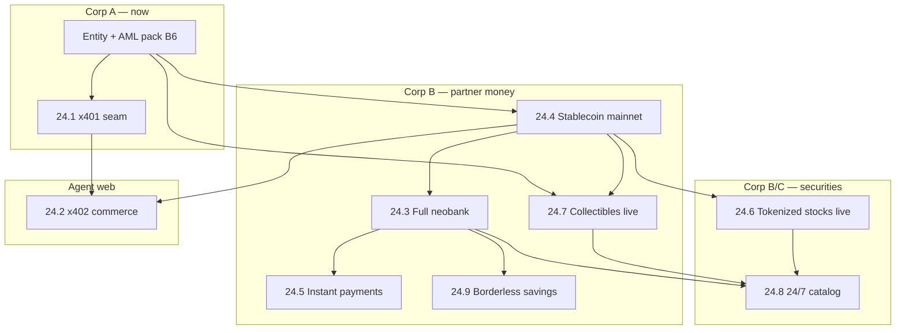

# Phase 24 — Production launch suite (x401/x402 + full money product)

**Status: IN PROGRESS (24.8a–24.9a + production readiness slices BUILT).** Phase 24 is the **go-live orchestration layer** that takes
prototype seams from Phases 5–22 and the agentic identity stack (Phases 2/7/10/11/21) to **production-ready,
partner-backed, counsel-cleared** offerings. It does **not** introduce prediction markets or perpetual
derivatives — those remain out of scope (see §12).

This doc folds the feature-coverage review into a single staged plan with explicit steps to get each
capability **live**. Read with: `docs/ARGUS-PLAN.md` · `docs/PRD-PHASE-MATRIX.md` ·
`docs/business/CORP-B-RAMP.md` · `docs/business/LAUNCH-READINESS.md` · `docs/business/PAYMENT-NETWORK-STRATEGY.md`.

**Related prototype seams (already built, not production):**

| Workstream | Prototype home | Kill-switch / config |
|---|---|---|
| OID4VP + VC + MCP | `presentationService`, Phase 7/11 | — |
| Checkout VP (merchant) | `presentationService` checkout path | `CHECKOUT_VP_ENABLED` |
| Argus Pay | `paymentService`, `/api/pay` | `ARGUS_PAY_ENABLED` |
| Bank rails | `bankRailService`, Phase 19 | `BANK_RAILS_ENABLED` |
| Cards / bill pay | `cardService`, `billPayService` | `CARDS_ENABLED`, `BILLPAY_ENABLED` |
| USDC / Hedera | `hederaService`, wallet | `HEDERA_ENABLED` |
| Tokenized equities | Phase 18.6 | `EQUITIES_ENABLED` |
| Tokenized collectibles | Phase 8 + Courtyard | `COLLECTIBLES_ESCROW_ENABLED` |
| FX / cross-border | `fxSettlementService`, `crossBorderService` | `FX_SETTLEMENT_ENABLED` |
| Savings | `user_savings`, `interestAccrualService` (teen) | `TEEN_ENABLED` |

**Build status (code landed):**

| Stage | What | Service / routes | Tests |
|---|---|---|---|
| **24.8a** | Supported product catalog | `productCatalogService`, `GET /api/products/supported` | `phase24.test.ts` |
| **24.1a** | x401 HTTP proof (Argus VC) | `x401Service`, `/api/x401/*` | `phase24.test.ts` |
| **24.1b** | Verification token exchange | `x401_verification_tokens`, `POST /api/x401/token/redeem` | `phase24.test.ts` |
| **24.2a** | x402 HTTP pay gate | `x402Service`, `/api/x402/*` | `phase24.test.ts` |
| **24.9a** | Borderless USDC savings | `savingsProductService`, `/api/savings/borderless/*` | `phase24.test.ts` |
| **24.4a** | Stablecoin production status | `stablecoinProductionService`, `/api/phase24/stablecoin/status` | `phase24.test.ts` |
| **24.7a** | Collectibles go-live status | `collectiblesGoLiveService`, `/api/collectibles/go-live-status` | `phase24.test.ts` |
| **24.5a** | Instant payment SLAs | `instantPaymentsService`, `/api/phase24/instant/sla` | `phase24.test.ts` |
| **24.1c** | Identity issuer seam | `identityIssuerService`, `/api/phase24/identity/issuer` | `phase24.test.ts` |
| **24.1d** | Verifiable intents | `verifiableIntentService` | `phase24.test.ts` |
| **24.2c** | Stacked agent commerce | `agentCommerceService`, `/api/phase24/agent-commerce/gate` | `phase24.test.ts` |
| **24.3a** | Neobank readiness + webhook stub | `neobankProductionService`, `/api/webhooks/bank/column` | `phase24.test.ts` |
| **24.6a** | Equity production readiness | `equityProductionService`, `/api/phase24/readiness` | `phase24.test.ts` |
| 24.3b–f | Live BaaS / cards / bill pay | partner contracts | — |
| 24.4b–e | Circle CCTP / on-ramp prod | Circle | — |

---

## 1. Problem statement

Argus has **breadth ahead of launch**: simulated partner seams, demo marketplace inventory, and a strong
agent-native identity model — but **production readiness** is gated on partners, counsel, and operational
runbooks (`LAUNCH-READINESS.md` §3). Phase 24 names the **nine product capabilities** that must cross the
line together (or in a dependency-safe sequence) for a credible **tokenization-first neobank**, plus the
**x401/x402 agent-web protocols** that sit above the existing VC/OID4VP stack.

---

## 2. Scope (in) vs out

### In scope (Phase 24 workstreams)

1. **Proof x401 Identity Intent** — HTTP-native proof requirements (`PROOF-REQUIRED` / `PROOF-PRESENTATION`)
2. **x402 Agent Commerce** — HTTP-native payment requirements composable with x401
3. **Full neobank offering** — partner bank, MSB, KYC/AML, cards, bill pay, statements (Phase 19 prod)
4. **Stablecoin production** — mainnet USDC, Circle/CCTP, reconciliation at scale
5. **Instant payments** — native-rail SLAs + FedNow/RTP via partner where offered
6. **Tokenized stocks live** — regulated 1:1 issuer integration (Phase 18.6 prod)
7. **Tokenized collectibles live** — Courtyard + in-app escrow counsel clearance
8. **Global 24/7 markets** — **supported products only** (explicit catalog + hours; no “trade everything” claim)
9. **Borderless savings** — adult high-yield savings + corridor on-ramps (not teen-only)

### Out of scope

- Prediction markets, event contracts, sports betting
- Perpetual futures / “perps on everything”
- Replacing Visa/MC general in-store acceptance (Visa **bridge** remains Corp B barbell per payment strategy)
- Phase 23 Command Center implementation (parallel track; recommended before Corp B go-live)

---

## 3. Architecture principles (carry forward)

1. **Ledger is truth** — partner bank, Hedera, issuers mirror the ledger; never replace it.
2. **VP verified before access** — x401/x402 are HTTP transports; cryptographic verification still runs through
   `presentationService` rules (signature, nonce, grant, scope intersection).
3. **Idempotency on all money POSTs** — x402 settlement keys map to existing `Idempotency-Key` + journal keys.
4. **Kill-switches stay prod-fatal** until counsel clears each rail (`productionFatals()`).
5. **Supported-product honesty** — 24/7 availability is **per SKU** in a public `market_hours` registry; trad-fi
   instruments follow exchange calendars even when the chain settles 24/7.

---

## 3.5 Standalone-first path (minimal partners)

**Goal:** A fully functional Argus money + agent product **without** partner bank, Courtyard, Dinari, or Proof.com.

| Capability | Standalone (no partner) | Optional partner (later) |
|---|---|---|
| x401 identity | Argus-issued VC + `did:key` wallet (`IDENTITY_ISSUER=argus`) | Proof.com OID4VC (`IDENTITY_ISSUER=proof`) |
| x402 commerce | USDC/USD on ledger via Argus Pay | Card acquirer / Visa bridge |
| Stablecoin | Hedera testnet → self-hosted mainnet operator | Circle treasury / CCTP |
| Instant pay | Ledger P2P + Argus Pay (seconds) | FedNow/RTP via Column |
| Collectibles | Demo seed + seller P2P listings | Courtyard vault API |
| Tokenized stocks | Simulated `EQUITY_ISSUER=simulated` (demo) | Dinari / Backed |
| Neobank | **Not standalone** — needs BaaS for fiat FDIC | Column / Treasury Prime |
| Borderless savings | Self-accrual from `interest_source` (`BORDERLESS_SAVINGS_ENABLED`) | Partner-bank HYSA |
| 24/7 markets | Catalog marks only SKUs that are truly 24/7 | ATS / exchange calendars for trad-fi |

### Standalone dev `.env` (go-live on testnet / Phase A)

```bash
X401_ENABLED=1
X402_ENABLED=1
ARGUS_PAY_ENABLED=1
CHECKOUT_VP_ENABLED=1
BORDERLESS_SAVINGS_ENABLED=1
SAVINGS_APY_BPS=350
HEDERA_ENABLED=1          # testnet first; mainnet = 24.4
# Leave OFF until partners: BANK_RAILS_ENABLED, EQUITIES_ENABLED (live issuer), COLLECTIBLES_ESCROW_ENABLED (real money counsel)
```

### Coding order (what ships first)

1. **24.8a** product catalog — honest SKU list (`/api/products/supported`)
2. **24.1a+b** x401 headers + verification tokens (`/api/x401`)
3. **24.2a** x402 pay gate (`/api/x402`) — stacks on Argus Pay + checkout VP
4. **24.9a** borderless savings (`/api/savings/borderless`)
5. **24.4** stablecoin mainnet hardening (Hedera + reconciliation — no bank)
6. **24.7** collectibles escrow (counsel only; no Courtyard required for seller P2P)
7. **24.5** instant payment SLAs (metrics + status page)
8. **24.3** neobank (first **mandatory** partner: BaaS bank)
9. **24.6** tokenized stocks live issuer (first securities partner)

---

## 4. Dependency graph (recommended go-live order)



**Parallel tracks:** Phase 23 Command Center (ops visibility) can build alongside 24.1–24.4. Collectibles
(24.7) can go live **before** full neobank if counsel scopes MSB narrowly to marketplace intermediary.

---

## 5. Workstream detail — prototype → production steps

### 24.1 — Proof x401 Identity Intent Support

**Today:** Argus implements **OID4VP-style** challenges via `/api/present/challenge` + wallet-signed VP JWT +
90s scoped tokens (`presentationService`). No `PROOF-REQUIRED` / `PROOF-PRESENTATION` HTTP headers; no Proof
issuer adapter.

**Target:** Issuer-neutral x401 verifier on protected routes; optional **Proof Digital ID** as an external
issuer alongside Argus-issued VCs.

| Stage | Engineering | Partner / counsel | Exit criteria |
|---|---|---|---|
| **24.1a — Verifier seam** | `x401Middleware`: emit `PROOF-REQUIRED` with embedded OpenID4VP-shaped `credential_requirements`; accept `PROOF-PRESENTATION` → delegate to `verifyPresentation()` | Review x401 spec v0.2+ (`x401.proof.com/spec`) | `x401.test.ts`: challenge → VP → 200; bad VP → `PROOF-RESPONSE` error |
| **24.1b — Verification token** | Optional OAuth-style verification token exchange (x401 leg 4) → maps to existing scoped JWT | — | Agent replays token without re-presenting within TTL |
| **24.1c — Proof issuer adapter** | `IdentityIssuerProvider`: `argus` (default VC) \| `proof` (OID4VC to Proof API) | Proof commercial API + DPA | Wallet or cloud wallet satisfies Proof-issued credential in e2e demo |
| **24.1d — Intent binding** | Bind x401 proof to **Verifiable Intent** payloads (AP2-shaped authorization records) for high-value ops | Counsel: e-sign / UETA evidence | Audit log stores intent hash + VP hash + user id |

**Reuses:** `presentationService`, `vcService`, `userAgentGrantService`, checkout VP path, Phase 10 token relay.

**Config (proposed):** `X401_ENABLED`, `X401_SIGNED_REQUESTS`, `IDENTITY_ISSUER=argus|proof`, `PROOF_API_KEY`.

---

### 24.2 — x402 Agent Commerce

**Today:** Argus Pay (`paymentService`) + MCP `pay_merchant` + checkout VP — **application-layer** commerce,
not HTTP 402.

**Target:** x402-compatible resources: server responds with payment requirement; agent pays via stablecoin
settlement; composes with x401 (“who authorized” before “what paid”).

| Stage | Engineering | Partner / counsel | Exit criteria |
|---|---|---|---|
| **24.2a — HTTP 402 seam** | `x402Middleware`: `402 Payment Required` + `PAYMENT-REQUIRED` body (amount, currency, payee, expiry) mapped to `payment_intents` | MSB / money-transmission review for programmatic pay | Curl + agent demo: 402 → pay → 200 |
| **24.2b — Agent settlement** | Wire x402 fulfillment to `payIntent()` (USDC ledger + Hedera mirror) idempotent on x402 `payment_id` | Circle/mainnet from 24.4 | Paid resource unlocked; append-only `payment_events` |
| **24.2c — x401 + x402 stack** | Protected API route: x401 proof → scoped token → x402 pay → content | — | Harness: present → pay → fetch in one agent session |
| **24.2d — External merchant SDK** | Publish `@argus/x402` helper (fetch wrapper) for third-party sites | Merchant terms + dispute policy | Reference merchant on `/pay` docs |

**Reuses:** Phase 21 Argus Pay, escrow admin surface, MCP scopes, `presentationService`.

**Config (proposed):** `X402_ENABLED`, `X402_DEFAULT_CURRENCY=USDC`, extends `ARGUS_PAY_ENABLED`.

**Explicitly not in 24.2:** Card-network acquirer; x402 is **native-rail** agent commerce first.

---

### 24.3 — Full Neobank Offering

**Today:** Phase 19 **Stage-1 simulated** — deposit/withdraw/statement/cards/bill pay with `BankRailProvider`
and `CardProcessor` stubs.

**Target:** Daily-driver US account: FDIC *via partner*, industrial KYC/AML, real ACH/wire, debit card, bill pay.

| Stage | Engineering | Partner / counsel | Exit criteria |
|---|---|---|---|
| **24.3a — Corp B entity** | No code — B6 checklist | Entity, FinCEN MSB, AML program, compliance officer | `LAUNCH-READINESS.md` B6 rows green |
| **24.3b — Partner bank** | `BANK_RAIL_PROVIDER=column` (or TP/Unit); webhooks for deposit/return; `fboCoverage` live | Column term sheet | Real ACH push/pull in staging |
| **24.3c — IDV + fraud** | `IDV_PROVIDER=persona`; `FRAUD_ENGINE_URL` prod; travel rule above $3k | Persona + TRM/Chainalysis | Tier 2 onboarding live |
| **24.3d — Cards** | `CARD_PROCESSOR=marqeta` or Lithic; PCI scope with processor | BIN sponsor | Physical/virtual card auth→capture |
| **24.3e — Bill pay + statements** | Biller network via bank partner; 1099-INT export path | Biller network contract | Scheduled bill + PDF statement |
| **24.3f — Prod fatals off** | Remove simulated providers from `productionFatals()` per rail | Sign-off per flag | `BANK_RAILS_ENABLED`, `CARDS_ENABLED`, `BILLPAY_ENABLED` prod-safe |

**Reuses:** Entire Phase 19 surface + frontend `Bank`/`Cards`/`Bills` pages.

**Doc owner:** `docs/business/CORP-B-RAMP.md` cutover order (steps 1–5, 8).

---

### 24.4 — Stablecoin (production)

**Today:** USDC on Hedera (testnet/simulated), on/off-ramp seams, CCTP stub, ledger⇄chain reconciliation **built**.

**Target:** Mainnet USDC with Circle relationship, attested reconciliation, KMS/HSM operator custody.

| Stage | Engineering | Partner / counsel | Exit criteria |
|---|---|---|---|
| **24.4a — Mainnet Hedera** | `HEDERA_NETWORK=mainnet`; `HEDERA_SIGNER=hsm`; user keys stay on-device | KMS/HSM prod | J4 e2e on mainnet test user |
| **24.4b — Circle USDC** | `HEDERA_USDC_TOKEN_ID` prod; treasury + paymaster funded | Circle Programmable Wallets / treasury agreement | Mint/transfer/burn reconciled |
| **24.4c — CCTP** | `CCTP_PROVIDER=circle` for ETH↔Hedera USDC | Circle CCTP API | Bridge e2e with reconciliation |
| **24.4d — On/off-ramp prod** | `ONRAMP_ENABLED` / `OFFRAMP_ENABLED` with live provider (not simulated) | Partner bank + MSB from 24.3 | J14/J15 green on staging |
| **24.4e — Reconciliation gate** | Daily job + `RECONCILIATION_HOLD` enforced in prod | Ops runbook | Zero unacknowledged drift > 24h |

**Reuses:** Phase 5 Hedera, Phase 20 reconciliation, Phase 41/43 on/off-ramp routes.

---

### 24.5 — Instant Payments

**Today:** **Instant on native rail** (ledger transfer, Argus Pay USDC, P2P payment requests). Bank
`method: "instant"` is a **label**; real FedNow/RTP not wired (`LAUNCH-READINESS.md`).

**Target:** Published SLAs per rail; FedNow/RTP where partner bank supports; card auth realtime.

| Stage | Engineering | Partner / counsel | Exit criteria |
|---|---|---|---|
| **24.5a — Native rail SLA** | Metrics: p99 transfer latency; status page | — | Public SLA doc: ledger P2P < 2s |
| **24.5b — FedNow/RTP** | Map `bank.withdraw(method: instant)` to partner instant rail API | Partner bank FedNow participation | Credit within 60s (PRD REQ-PAY-US-008) |
| **24.5c — Argus Pay instant** | Hedera finality monitoring; intent TTL defaults | — | Merchant webhook on `paid` < 10s p99 |
| **24.5d — Cross-border instant** | `crossBorderService` prod FX provider (`FX_RATE_PROVIDER` ≠ simulated) | FX liquidity partner | Corridor quote→settle e2e NG/PH/BR pilot |

**Reuses:** `bankRailService`, `paymentService`, `crossBorderService`, `paymentRequestService`.

**Marketing rule:** Never claim “instant” for ACH standard windows — only instant-class rails.

---

### 24.6 — Tokenized Stocks (live)

**Today:** Phase 18.6 **prototype seam** — simulated `EquityIssuer`, dividends, redemption; prod-fatal.

**Target:** Live 1:1-backed public equities via **v1 issuer pass-through** (Dinari / Backed / Ondo).

| Stage | Engineering | Partner / counsel | Exit criteria |
|---|---|---|---|
| **24.6a — Issuer contract** | `EQUITY_ISSUER=dinari` (or backed); implement live API in `equityIssuerService` | Securities counsel + issuer MSA | Sandbox subscribe/redeem |
| **24.6b — Backing attestation** | Poll `backingAttestation()` → reconciliation findings | Issuer PoR feed | Drift gates new issuance |
| **24.6c — Corporate actions** | Live dividend feed → `corporateActionService.distribute` | 1099-DIV process with issuer | Dividend e2e on staging |
| **24.6d — Compliance matrix** | Jurisdiction + accredited flags on equity listings | Reg D / issuer rules | Tier-2+ US user can buy AAPL token |
| **24.6e — Prod enable** | `EQUITIES_ENABLED` prod-safe | B4/BD sign-off | Invest tab live inventory ≠ demo seed |

**Reuses:** Phase 8 marketplace, Phase 18.6 services, `complianceService`.

**Doc owner:** `docs/PHASE-18.6-TOKENIZED-EQUITIES.md`.

**Not in scope:** Off-chain Phase 17 brokerage as substitute — tokenized stocks are **on-chain 1:1** SKUs.

---

### 24.7 — Tokenized Collectibles (live)

**Today:** Strongest wedge — Phase 8 Collect, Courtyard provider seam, seller P2P escrow prototype; real-money
escrow **prod-fatal** pending MSB/marketplace counsel.

**Target:** Courtyard-backed inventory, escrow-protected checkout, HTS mint where applicable, Phase A → Corp B
first revenue surface.

| Stage | Engineering | Partner / counsel | Exit criteria |
|---|---|---|---|
| **24.7a — Courtyard live** | `COLLECTIBLES_PROVIDER=courtyard`; sync + webhooks | Courtyard API contract (`integrations/COURTYARD-INTEGRATION.md`) | Admin sync imports live slabs |
| **24.7b — Escrow counsel** | Enable `COLLECTIBLES_ESCROW_ENABLED` in prod | MSB / marketplace intermediary memo | Written counsel sign-off |
| **24.7c — Escrow money path** | `collectiblePurchaseService` prod USDC + dispute admin | — | Buy slab e2e: hold → ship → capture |
| **24.7d — Seller P2P** | Seller submission + human review queue (existing) | Seller terms | P2P listing live with caps |
| **24.7e — GTM** | Waitlist → transact (`GTM-COLLECTIBLES-LAUNCH.md`) | Marketing say/never-say review | First paid collectible order |

**Reuses:** Phase 8, Phase 29–30 seller/collectible migrations, admin collectibles console.

---

### 24.8 — Global 24/7 Markets (**supported products only**)

**Today:** Chain settles continuously; marketplace and FX seams exist; no unified **product catalog** with
honest hours; trad-fi trading simulated (Phase 17).

**Target:** A **`supported_products` registry** drives UX, agent tools, and marketing — each SKU declares
`availability: 24_7 | exchange_hours | corridor_limited` and `regions[]`.

| Stage | Engineering | Partner / counsel | Exit criteria |
|---|---|---|---|
| **24.8a — Product registry** | `productCatalogService`: SKU → asset class, hours, regions, min tier | Product/legal review of list | API `/api/products/supported` |
| **24.8b — 24/7 SKUs** | Mark: USDC wallet P2P, Argus Pay, tokenized collectibles secondary, on-chain equity tokens | — | UI badge “Available now” only for 24_7 |
| **24.8c — Exchange-hours SKUs** | Mark: Phase 17 spot equities/options when live; halt flags | BD partner market calendar | Orders rejected outside hours with clear code |
| **24.8d — Corridor SKUs** | Cross-border + off-ramp per country from registry | Corridor licenses | Send Abroad only shows supported corridors |
| **24.8e — Agent scope** | MCP/SmartChat tools filter by registry — agents cannot trade unsupported SKUs | — | Harness: unsupported product → `NOT_IMPLEMENTED` |

**Principle:** Argus markets **what it supports**, 24/7 where technically and legally true — never imply
NYSE-hours products trade overnight.

**Reuses:** `currencyRegistry`, marketplace listings, Phase 17 instruments, cross-border tables.

---

### 24.9 — Borderless Savings

**Today:** `user_savings` ledger account; teen APY via Phase 22; FX/cross-border seams; **no adult HYSA product**.

**Target:** High-yield stablecoin/fiat savings for global users — self-custodial USD exposure + partner-backed
yield where offered.

| Stage | Engineering | Partner / counsel | Exit criteria |
|---|---|---|---|
| **24.9a — Adult savings SKU** | `savingsProductService`: APY tier, min balance, statements | Partner yield program or on-chain T-bill token (Ondo/BUIDL) | Savings tab ≠ teen-only |
| **24.9b — Interest accrual prod** | Extend `interestAccrualService` to adult accounts; daily cron | 1099-INT process | Accrual journal idempotent per period |
| **24.9c — Corridor on-ramps** | Local currency → USDC/USDC savings via on-ramp partners | NG/PH/BR corridor partners (PRD Module 06) | J-style e2e per pilot corridor |
| **24.9d — Borderless UX** | Multi-currency display; savings in USDC with FX view | Marketing: not FDIC until partner path clear | `/savings` page live |
| **24.9e — Agent access** | MCP `savings:read` / `savings:transfer` scopes | — | Agent quote savings APY read-only |

**Reuses:** Phase 22 savings machinery, Phase 19 bank rails, Phase 40 cross-border, tokenized treasury (F1).

**Dependency:** 24.4 stablecoin prod + 24.3 neobank (for FDIC-via-partner fiat savings) or pure USDC savings
path for non-US users first.

---

## 6. Staged master checklist (Phase 24.0 → 24.9)

| Milestone | Delivers | Corp gate | Depends on |
|---|---|---|---|
| **24.0** | Program kickoff: counsel engaged, partner pipeline, prod env template (all money flags off) | A | — |
| **24.1** | x401 verifier + Argus VC path | A | 24.0 |
| **24.2** | x402 + x401 stacked agent commerce | B (MSB) | 24.1, 24.4a |
| **24.3** | Full neobank rails live | B | 24.0, 24.4 |
| **24.4** | Stablecoin mainnet + reconciliation | B | 24.0 |
| **24.5** | Instant payments SLAs + FedNow | B | 24.3 |
| **24.6** | Tokenized stocks live | B/C | 24.4, securities counsel |
| **24.7** | Tokenized collectibles live | B | 24.4, escrow counsel |
| **24.8** | Supported-product 24/7 catalog | A/B | 24.6, 24.7 |
| **24.9** | Borderless savings live | B | 24.3, 24.4 |

**Suggested first revenue path (from GTM):** 24.7 collectibles → 24.4 stablecoin → 24.2 agent checkout →
24.3 neobank → 24.9 savings → 24.6 equities.

---

## 7. Config & kill-switch summary (production)

| Flag | Workstream | Prod today | Phase 24 exit |
|---|---|---|---|
| `X401_ENABLED` | 24.1 | n/a (new) | counsel + tests |
| `X402_ENABLED` | 24.2 | n/a (new) | MSB + tests |
| `BANK_RAILS_ENABLED` | 24.3 | prod-fatal | partner live |
| `CARDS_ENABLED` | 24.3 | prod-fatal | BIN sponsor |
| `BILLPAY_ENABLED` | 24.3 | prod-fatal | biller network |
| `HEDERA_ENABLED` | 24.4 | env-specific | mainnet + HSM |
| `ONRAMP_ENABLED` / `OFFRAMP_ENABLED` | 24.4, 24.9 | prod-fatal | live provider |
| `CCTP_ENABLED` | 24.4 | prod-fatal | Circle |
| `ARGUS_PAY_ENABLED` | 24.2, 24.5 | prod-fatal | MSB |
| `EQUITIES_ENABLED` | 24.6 | prod-fatal | issuer + BD |
| `COLLECTIBLES_ESCROW_ENABLED` | 24.7 | prod-fatal | counsel memo |
| `FX_SETTLEMENT_ENABLED` | 24.5, 24.9 | prod-fatal | FX partner |
| `TEEN_ENABLED` | (Phase 22) | prod-fatal | separate from 24.9 adult SKU |

---

## 8. Testing & validation gates

Each workstream ships with:

1. **Vitest** service tests (integer money, idempotency, append-only)
2. **e2e-validator** journey extension (document new J# in `E2E-VALIDATION.md`)
3. **argus-mcp-test-harness** path for x401/x402 + pay flows
4. **Launch-readiness row** updated in `LAUNCH-READINESS.md`
5. **CEO Agentic OS gate** for any new regulated SKU copy (`launch_decision` task class → Anthropic-pinned)

Proposed new journeys:

| Journey | Workstream |
|---|---|
| J20 | x401 challenge → VP → verification token |
| J21 | x402 402 → pay intent → resource |
| J22 | Collectible escrow buy → capture |
| J23 | Equity subscribe → dividend → redeem |
| J24 | Borderless savings deposit → accrual → withdraw |

---

## 9. Operations & runbooks (production reality)

From `LAUNCH-READINESS.md` — Phase 24 go-live **requires** (not optional):

- Customer support console + dispute/chargeback ops (collectibles + Argus Pay)
- Statements + tax docs (1099-INT/B/DIV)
- Push notifications (payment received, escrow shipped)
- SOC 2 + status page + incident response
- Phase 23 Command Center (recommended) for FBO/drift/fraud tiles

---

## 10. Open questions (resolve before 24.0 kickoff)

| ID | Question | Owner |
|---|---|---|
| Q24-1 | Proof commercial terms vs issuer-neutral self-hosted x401 only? | Founder + counsel |
| Q24-2 | x402 first merchant: internal Argus Pay only or external SDK day one? | Product |
| Q24-3 | Collectibles before neobank vs full bank first? | CEO (GTM recommends collectibles) |
| Q24-4 | Adult savings: partner-bank yield vs tokenized T-bill (Ondo/BUIDL) first? | CFO + counsel |
| Q24-5 | Which corridors for 24.9 pilot (NG, PH, BR per PRD)? | BD |
| Q24-6 | Phase 17 off-chain trading: include in 24.8 catalog or defer until Corp C? | Product (recommend defer) |

---

## 11. Relationship to other phases

| Phase | Relationship to 24 |
|---|---|
| **17** Trading/brokerage | Optional add-on to 24.8 catalog; **not** required for Phase 24 core nine |
| **18** Tokenization prod | 24.6/24.7 are the live subsets of 18 + 18.6 |
| **19** Bank rails | 24.3 is Phase 19 production cutover |
| **20** Hardening | 24.4 reconciliation + fraud prod are prerequisites |
| **21** Argus Pay | 24.2 x402 wraps Phase 21 |
| **22** Teen starter | Parallel; 24.9 is **adult borderless** savings |
| **23** Command Center | Ops visibility before Corp B; not blocking 24.7 wedge |

---

## 12. Explicit non-goals (unchanged)

- **Prediction markets** — no CFTC event-contract program; not planned
- **Perps on everything** — conflicts with Phase 18.6 “no derivatives”; would require Corp C + CFTC
- **General-purpose 24/7 NYSE trading claims** — prohibited by 24.8 supported-product rule

---

## 13. Go-live checklists

### 13.A Standalone go-live (minimal partners — Phase A / testnet)

Use when `IDENTITY_ISSUER=argus`, no BaaS, no live issuer.

| Step | Action | Owner | Done when |
|---|---|---|---|
| A1 | Entity + IP assignment (B6) | Founder + counsel | Corp A exists |
| A2 | Enable standalone flags (§3.5 `.env`) | Eng | `/api/products/supported` shows ≥5 enabled SKUs |
| A3 | Hedera testnet wallet e2e | Eng | J4 green (receive/send) |
| A4 | x401 agent path e2e | Eng | `phase24.test.ts` + harness: challenge → present → token |
| A5 | x402 merchant demo | Eng | 402 → VP pay → resource unlocked |
| A6 | Borderless savings disclosure in UI | Product | “Not FDIC” copy approved by counsel |
| A7 | Marketing say/never-say (collectibles + savings APY) | Counsel | Written sign-off |
| A8 | Trail of Bits / security review for VP + money paths | Eng | Audit scheduled or complete |
| A9 | `e2e-validator full` green | Eng | Report archived |

**No partners required** for A2–A6 beyond Hedera testnet (public network).

### 13.B Partner go-live (add only when needed)

| Step | Capability | Partner | Blocks |
|---|---|---|---|
| B1 | Fiat ACH / FDIC | Column / Treasury Prime | Full neobank (24.3) |
| B2 | FedNow instant fiat | Partner bank | 24.5 fiat instant |
| B3 | Collectible vault inventory | Courtyard | Branded graded inventory |
| B4 | Live tokenized equities | Dinari / Backed | Real stock tokens (24.6) |
| B5 | MSB registration | FinCEN | Real-money x402 / Argus Pay at scale |
| B6 | Circle CCTP / treasury | Circle | Cross-chain USDC prod (24.4) |

**Rule:** Do not enable `productionFatals()` partner flags until the matching B-row is complete.

---

*Strategy and engineering plan only — not legal, tax, or investment advice. Every regulated surface requires
human counsel sign-off before production flags clear `productionFatals()`.*
