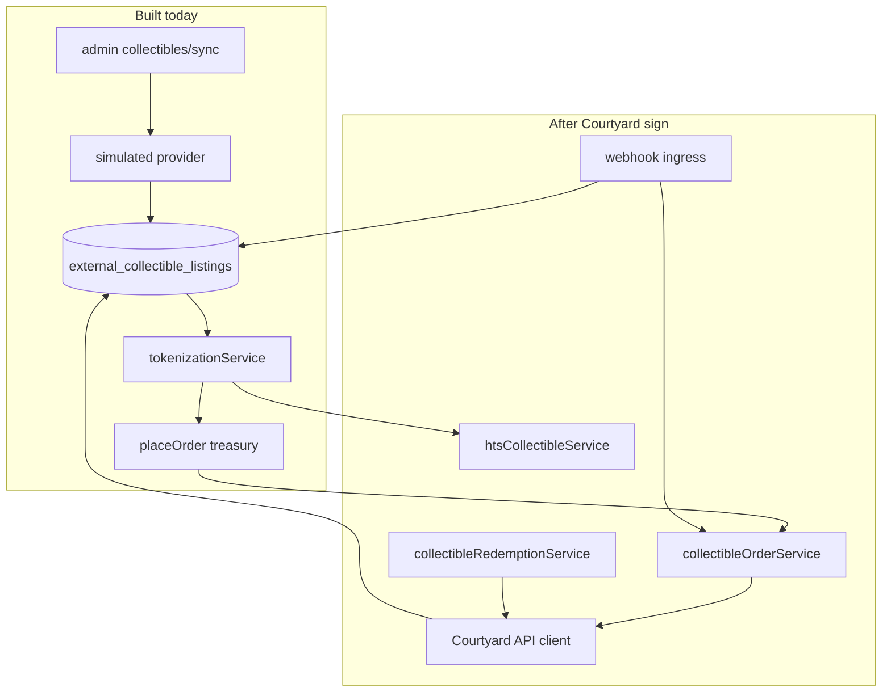
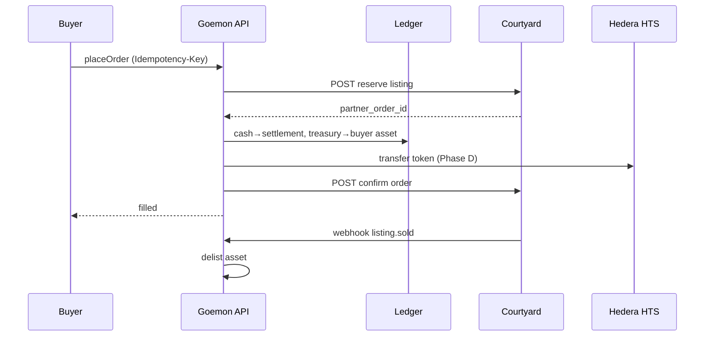
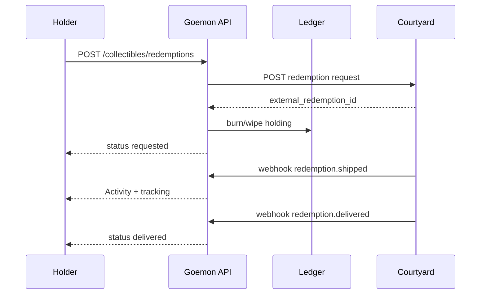

# Courtyard integration — implementation sketch

End-to-end plan for **Tier 3 vault inventory** (Courtyard custodied slabs) on top of existing seams. This is **not** config-only today: `COLLECTIBLES_PROVIDER=courtyard` throws `NOT_IMPLEMENTED` until the provider client is wired.

**Parallel lane:** seller P2P (`COLLECTIBLES_ESCROW_ENABLED`, ship/confirm) stays independent — Courtyard does not replace it.

## Architecture (today → target)



| Concern | Existing seam | Gap |
|---|---|---|
| Inventory sync | `collectiblesProvider.ts` + migration `027` | Real `courtyard` provider |
| Buy | `marketplaceService.placeOrder` | Partner reserve/settle on purchase |
| Webhooks | — | New signed ingress + handlers |
| Real HTS | `tokenizationService` (simulated `0.0.SIM-*`) | Operator create/mint/transfer/wipe |
| Redemption | `redemptionService` (equities only) | Collectible burn + partner ship API |
| UX | `AssetDetail`, `Collect`, Activity | Redemption sheet + status in Activity |

---

## Phase A — Provider client + config (inventory sync)

**Goal:** `COLLECTIBLES_PROVIDER=courtyard` + admin sync pulls live vault catalog into Collect.

### Config (add to `backend/src/config.ts`)

```bash
COLLECTIBLES_PROVIDER=courtyard          # enum already exists
COURTYARD_API_BASE_URL=https://...       # partner doc
COURTYARD_API_KEY=...                    # or OAuth client creds
COURTYARD_WEBHOOK_SECRET=...             # Phase C
COURTYARD_SYNC_PAGE_SIZE=100
```

Optional prod gate (mirror other Corp B rails):

```typescript
if (c.COLLECTIBLES_PROVIDER === "courtyard" && !c.COURTYARD_API_KEY) {
  fatal.push("COLLECTIBLES_PROVIDER=courtyard requires COURTYARD_API_KEY.");
}
```

### Code changes

| File | Change |
|---|---|
| `backend/src/services/collectiblesProvider.ts` | Replace `notImplemented("courtyard")` with `courtyardProvider()` |
| `backend/src/integrations/courtyard/client.ts` | **New** — fetch, auth, retries, rate limits |
| `backend/src/integrations/courtyard/types.ts` | **New** — map Courtyard JSON → `ExternalCollectibleItem` |
| `backend/test/courtyard-provider.test.ts` | **New** — contract tests with recorded fixtures |

### Courtyard API mapping (confirm with partner docs)

Typical partner surface — replace paths when contract is signed:

| Courtyard (conceptual) | Goemon mapping |
|---|---|
| `GET /inventory` or `/listings?status=available` | `fetchInventory()` paginated |
| Item `id` | `externalId` |
| Title, category, grade, images | `title`, `category`, `grade`, `imageUrl` |
| Ask price (USD/USDC) | `askUsdcMicro` (integer micro-units) |
| Vault / custody location | `custodyVault` → `custodyAttestationUri` on asset |
| Cert number / PSA link | `metadata.certNumber`, `metadata.grader` |
| `redemptionEligible` flag | `metadata.redemption: true` |

### Sync behavior (extend `syncCollectiblesInventory`)

Already upserts `external_collectible_listings` and creates assets on first sight. Add:

1. **Delist on partner removal** — if item absent from fetch N runs or status `sold`/`withdrawn`, set `external_collectible_listings.status = 'inactive'` and `transitionListing(..., 'delisted')` (holdings preserved per REQ-MK-LIFE-003).
2. **Price refresh** — call `listings.updatePrice` when ask changes (new listing version row).
3. **Metadata hash** — skip no-op upserts; log drift in `collectibles_sync_runs`.

### Asset metadata convention (Courtyard lane)

```json
{
  "listingType": "courtyard_vault",
  "provider": "courtyard",
  "externalId": "cy-…",
  "redemption": true,
  "custodyVault": "Courtyard Delaware Vault",
  "certNumber": "12345678",
  "grader": "psa"
}
```

Use `listingType: courtyard_vault` (not `seller_p2p`) so buy stays on **`placeOrder`**, not escrow purchase flow.

### Frontend (minimal for Phase A)

No new pages — synced items appear on `/collect` via existing listings API. Optional: badge **Vault · Courtyard** on `AssetDetail` when `metadata.provider === "courtyard"`.

---

## Phase B — Purchase settlement (reserve → ledger → confirm)

**Goal:** A buy cannot complete locally if Courtyard cannot reserve the physical item.

### New service: `collectibleOrderService.ts`

Orchestrates partner order + existing ledger path:

```
placeOrder (Courtyard asset)
  → collectibleOrderService.purchaseCourtyardListing()
      1. assertCourtyardEnabled + tier/compliance (existing gates)
      2. POST Courtyard reserve/hold (external order id)
      3. marketplace placeOrder OR custom journal (cash → settlement, treasury → buyer)
      4. POST Courtyard confirm/settle (idempotent on Goemon order id)
      5. persist partner_order_id on order row
      on failure at 3: POST Courtyard release/cancel
```

### DB migration `031_courtyard_orders.sql`

```sql
ALTER TABLE orders ADD COLUMN partner TEXT;           -- 'courtyard'
ALTER TABLE orders ADD COLUMN partner_order_id TEXT;
ALTER TABLE orders ADD COLUMN partner_status TEXT;    -- reserved|settled|cancelled
CREATE INDEX idx_orders_partner ON orders(partner, partner_order_id);
```

Or a side table `external_collectible_orders (order_id, provider, external_id, partner_order_id, …)` if you prefer not to alter `orders`.

### API mapping (confirm with partner)

| Step | Courtyard (conceptual) | Idempotency key |
|---|---|---|
| Reserve | `POST /orders` `{ listingId, buyerRef }` | `courtyard:reserve:{idempotencyKey}` |
| Settle | `POST /orders/{id}/confirm` | `courtyard:settle:{orderId}` |
| Cancel | `POST /orders/{id}/cancel` | on ledger rollback |

### Hook point

In `marketplaceService.placeOrder`, before journal:

```typescript
if (asset.metadata?.listingType === "courtyard_vault") {
  return collectibleOrderService.purchaseCourtyardListing({ userId, assetId, qtyBase, idempotencyKey });
}
```

Keeps seller P2P and treasury demo assets unchanged.

---

## Phase C — Webhooks (inventory + orders + redemption status)

**Goal:** Near-real-time delist/sold/redemption updates without polling-only sync.

### Route: `POST /api/webhooks/courtyard`

| Concern | Implementation |
|---|---|
| Auth | HMAC-SHA256 of raw body with `COURTYARD_WEBHOOK_SECRET` (or partner JWT) |
| Idempotency | `webhook_events` table: `(provider, event_id)` unique |
| Replay | Return 200 on duplicate `event_id` |

### Migration `032_webhook_events.sql`

```sql
CREATE TABLE webhook_events (
  id           TEXT PRIMARY KEY,
  provider     TEXT NOT NULL,
  event_id     TEXT NOT NULL,
  event_type   TEXT NOT NULL,
  payload_json TEXT NOT NULL,
  processed_at TEXT,
  created_at   TEXT NOT NULL DEFAULT (datetime('now')),
  UNIQUE(provider, event_id)
);
```

### Handlers (sketch)

| Event (conceptual) | Action |
|---|---|
| `listing.sold` / `inventory.removed` | Delist asset; if open cart — reject |
| `listing.price_changed` | `updatePrice` |
| `order.confirmed` | Mark `partner_status = settled` (reconcile) |
| `redemption.shipped` | Update `collectible_redemptions.status` → `shipped` |
| `redemption.delivered` | → `delivered`; Activity feed |

Register webhook URL with Courtyard: `https://api.argus…/api/webhooks/courtyard`.

### Background reconcile (belt + suspenders)

Cron / admin job: compare `external_collectible_listings` where `status=active` against Courtyard inventory; fix drift if webhook missed.

---

## Phase D — Real HTS (on-chain collectible tokens)

**Goal:** Replace `0.0.SIM-*` placeholders with operator-created HTS tokens; ledger remains source of truth; chain mirrors settlement.

Today (`tokenizationService.ts`):

```typescript
hederaTokenId = isHederaEnabled()
  ? `0.0.SIM-${id.slice(0, 8)}`  // placeholder
  : `SIMTOKEN-…`
```

### New: `htsCollectibleService.ts`

| Operation | When | Hedera | Ledger |
|---|---|---|---|
| `createCollectibleToken(asset)` | First sync or admin mint | `TokenCreateTransaction` — supply 1, decimals 0, **Freeze key** = compliance multisig (REQ-MK-TOK-005) | Store real `hedera_token_id` on `assets` |
| `mintToTreasury(qty)` | Issuance | Mint to operator/treasury account | Existing `mint()` journal |
| `transferToBuyer(user, qty)` | After `placeOrder` | Transfer treasury → user Hedera account (auto-associate USDC pattern) | Existing order journal |
| `wipeForRedemption(user, qty)` | Redemption burn | `TokenWipe` or user-signed burn | Burn journal |

### Config

```bash
HEDERA_ENABLED=true
HEDERA_COLLECTIBLES_ENABLED=true    # new kill-switch; prod-fatal until audited
HEDERA_COLLECTIBLES_TREASURY_ACCOUNT=0.0.xxxx  # operator-held treasury for vault tokens
```

### Requirements trace

- `[REQ-MK-TOK-005]` Freeze key on compliance multisig — use existing signer/HSM seam (`signerService.ts`).
- `[REQ-MK-TOK-006]` Royalty — optional `CustomFee` on transfer; disclose in listing if enabled.
- `[REQ-MK-TOK-007]` `custodyAttestationUri` — Courtyard vault attestation URL or `cert:psa:{n}`.

### Phased rollout

1. **D1** — Create token on sync; ledger-only transfer (chain lag OK in dev).
2. **D2** — Atomic: ledger journal `externalRef` = Hedera tx id (same pattern as USDC escrow).
3. **D3** — Reconciliation job: treasury HTS balance vs ledger projection (extend `reconciliationService`).

---

## Phase E — Redemption UX + backend (physical ship)

**Goal:** REQ-WALLET-034 — user requests physical delivery; Courtyard fulfills; status in Activity.

Different from **equity** redemption (`redemptionService.redeem` = burn → cash). Collectible redemption = **burn/wipe token → partner ships slab**.

### New: `collectibleRedemptionService.ts`

Mirror equities pattern but partner-settled:

```
redeemPhysical(userId, assetId, shippingAddress, idempotencyKey)
  1. assert holder qty ≥ 1
  2. assert metadata.redemption === true && provider === courtyard
  3. POST Courtyard redemption API (shipping address, cert id)
  4. Ledger: user_asset → treasury (or wipe) — idempotent journal
  5. Optional HTS wipe (Phase D)
  6. Insert collectible_redemptions row status = requested
```

### Migration `033_collectible_redemptions.sql`

```sql
CREATE TABLE collectible_redemptions (
  id                  TEXT PRIMARY KEY,
  asset_id            TEXT NOT NULL,
  user_id             TEXT NOT NULL,
  provider            TEXT NOT NULL,
  external_redemption_id TEXT,
  qty_base            TEXT NOT NULL,
  shipping_json       TEXT NOT NULL,   -- encrypted or tokenized address
  status              TEXT NOT NULL     -- requested|processing|shipped|delivered|cancelled|failed
                      CHECK (status IN ('requested','processing','shipped','delivered','cancelled','failed')),
  partner_tracking    TEXT,
  journal_id          TEXT,
  idempotency_key     TEXT NOT NULL UNIQUE,
  created_at          TEXT NOT NULL,
  updated_at          TEXT NOT NULL
);
```

Webhook updates (Phase C) drive status transitions after step 3.

### API routes (`backend/src/routes/collectibles.ts`)

```
POST   /api/collectibles/redemptions              { assetId, shipping }  Idempotency-Key
GET    /api/collectibles/redemptions
GET    /api/collectibles/redemptions/:id
POST   /api/collectibles/redemptions/:id/cancel   (if partner allows pre-ship)
```

### Frontend UX

| Surface | Behavior |
|---|---|
| **AssetDetail** | If `metadata.redemption && holding > 0` → **Redeem physical** (secondary action) |
| **RedeemSheet** (new component) | Shipping address form, fee/disclosure (“partner ships from vault, 5–10 business days”), confirm |
| **`/collect/redemptions`** | List in-flight redemptions + tracking |
| **Activity** | Compose events: `collectible.redemption.requested`, `.shipped`, `.delivered` (extend Activity page query) |
| **Wallet / Collect holding** | “In vault · redeemable” vs “Token only” |

Copy blocks (UDAAP / B5):

- Physical redemption is fulfilled by **Courtyard**, not Goemon.
- Shipping fees / insurance disclosed before confirm.
- Token is burned/wiped on request; irreversible once partner accepts.

### iOS wallet (`GoemonWallet/`)

Phase 10 gap: redemption deep link or in-app WebView to portal redemption — v2; web-first for Corp B launch.

---

## End-to-end flows

### Buy (Courtyard vault)



### Redeem physical



---

## Build order (recommended)

| Stage | Deliverable | Depends on |
|---|---|---|
| **A** | Courtyard inventory sync live | Partner API creds, B5 draft |
| **B** | Reserve/settle on buy | A |
| **C** | Webhooks + reconcile job | B |
| **E1** | Redemption API + DB (simulated partner) | A |
| **E2** | Redemption UX (RedeemSheet, Activity) | E1 |
| **D1** | HTS TokenCreate on sync | Hedera operator, counsel |
| **D2** | HTS transfer on buy | D1, B |
| **D3** | HTS wipe on redemption | D2, E1 |
| **Legal** | B5 sign-off, prod fatals lifted | Counsel |

Run **A → B → C → E** before **D** if counsel wants vault inventory live before on-chain proof; run **D** in parallel in dev/testnet.

---

## Testing strategy

| Layer | Tests |
|---|---|
| Provider | `courtyard-provider.test.ts` — fixture JSON, mapping, pagination |
| Orders | `courtyard-orders.test.ts` — reserve fail rolls back; idempotent replay |
| Webhooks | `courtyard-webhooks.test.ts` — signature, duplicate event_id, handler side effects |
| HTS | `hts-collectibles.test.ts` — mock `Client`; extend `signer.test.ts` |
| Redemption | `collectible-redemption.test.ts` — burn + status machine |
| E2E | Extend Phase 16 journey: sync → buy Courtyard item → redeem (simulated partner) |

Use `setCollectiblesProvider(mock)` (already exists) for unit tests; WireMock or recorded fixtures for integration.

---

## Legal & ops checklist (non-code)

- [ ] B5 memo signed (`docs/legal/B5-collectibles-legal-memo.md`)
- [ ] Partner MSA: indemnity, insurance, delist rights, SLA
- [ ] Webhook endpoint on allowlist; secret rotation runbook
- [ ] Shipping / redemption fee disclosure in UI
- [ ] Prod: lift `COLLECTIBLES_PROVIDER=courtyard` fatals when creds + counsel clear
- [ ] Separate from `COLLECTIBLES_ESCROW_ENABLED` (seller P2P) — different agreements

---

## File tree (new / touched)

```
backend/src/
  integrations/courtyard/
    client.ts
    types.ts
    webhookHandlers.ts
  services/
    collectibleOrderService.ts      # Phase B
    collectibleRedemptionService.ts # Phase E
    htsCollectibleService.ts        # Phase D
    collectiblesProvider.ts         # wire courtyard
  routes/
    webhooks.ts                     # POST /api/webhooks/courtyard
    collectibles.ts                 # redemption routes
  db/migrations/
    031_courtyard_orders.sql
    032_webhook_events.sql
    033_collectible_redemptions.sql

frontend/src/
  components/RedeemSheet.tsx
  pages/CollectRedemptions.tsx
  pages/AssetDetail.tsx             # redeem CTA
  pages/Activity.tsx                # redemption events

docs/integrations/COURTYARD-INTEGRATION.md  # this file
```

---

## Related docs

- [CORP-B-RAMP.md](../business/CORP-B-RAMP.md) — partner matrix
- [CORP-B-COLLECTIBLES-ESCROW.md](../business/CORP-B-COLLECTIBLES-ESCROW.md) — seller P2P lane (orthogonal)
- [B5-collectibles-legal-memo.md](../legal/B5-collectibles-legal-memo.md)
- PRD Module 05 (`docs/goemon_prdv1/05-tokenization-and-marketplace.md`) — HTS + listing lifecycle
- PRD Module 04 — REQ-WALLET-034 redemption routing
